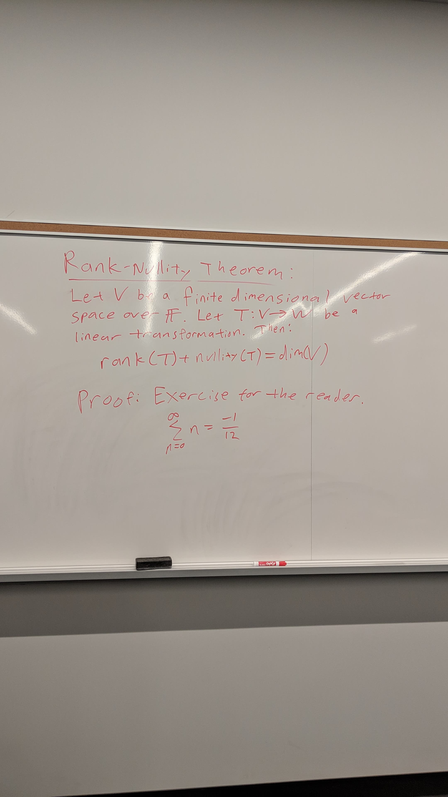
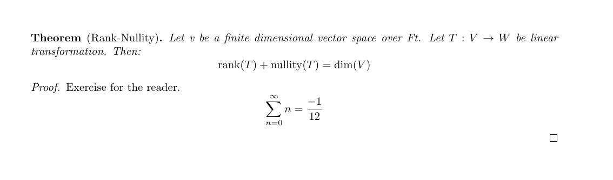

# board-to-latex

Take a picture of a blackboard or whiteboard, and convert it into a LaTeX 
document!

Hack the North 2019 hackathon project. As such, please excuse the 
hackathon-level code quality.

# Usage

## NOTE: Due to Google API changes, this project is no longer working, and development is paused indefinitely

Terminal UI:

```
./app/run_tui.sh <image_file>
```

For the web UI, see the instructions in the app folder.

# Samples

Input image:



Output pdf:



Output latex:

```latex
\begin{thm}[Rank-Nullity]
Let v be a finite dimensional vector space over Ft. Let $T : V \rightarrow W$ be linear transformation. Then: 
$$\operatorname { rank } ( T ) + \operatorname { nullity } ( T ) = \operatorname { dim } ( V )$$

\begin{proof}
Exercise for the reader. 
$$\sum _ { n = 0 } ^ { \infty } n = \frac { - 1 } { 12 }$$

\end{proof}
\end{thm}
```

# How it works

Due to hackathon time constraints, we were not able to train a neural network to 
accomplish this goal end-to-end as desired. Instead, we aimed for usability.

Current OCR implementations at the time, like MathPix and Google OCR, did not 
provide satisfactory results:

- Mathpix was good at math, but at the time had trouble with layout and general 
  text
- Google OCR was good at general text but could not do math

We combined the two, and developed a method that allows the app to split images 
into math components and text components to send off to either Mathpix/Google 
respectively. Each service would receive images to recognize that they are good 
at, and then our app would combine them after the fact. The end results, as seen 
in the samples section, worked quite nicely - it was a one-stop solution unlike 
mathpix at the time, and we put it into good use for several math lectures after 
the hackathon up until the API breakage.

